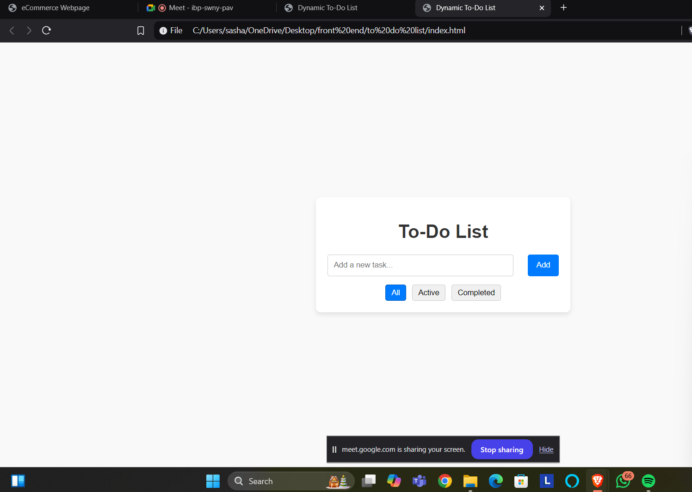

<h1>
  To Do List
</h1>
<h3>
  Summary
</h3>

  This to-do list application, created using HTML, CSS, and JavaScript, provides an intuitive interface for managing tasks. Users can add new tasks, mark tasks as completed, and remove them when done. The application leverages JavaScript for dynamic updates, ensuring that tasks appear immediately without requiring a page reload.

The CSS styling ensures a responsive and visually appealing layout suitable for various devices. Additional features like task prioritization, local storage for persistence, or drag-and-drop reordering can be integrated to enhance functionality.

This project is a great way to demonstrate skills in DOM manipulation, event handling, and user interface design, making it a valuable addition to any portfolio for showcasing web development capabilities

<h4>
  Output Before adding a task
</h4>

  Output After adding a task

